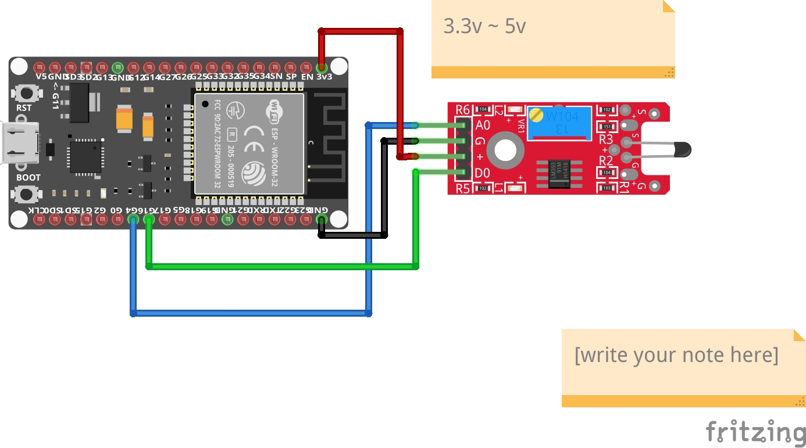

# Digital Temp

Este módulo para Arduino, mide los cambios de temperatura según la resistencia del termistor. Este módulo tiene salidas digitales y analógicas, hay un potenciómetro para ajustar el umbral de detección en la interfaz digital.

## Materiales

- Modulo Esp32 / Esp8266
- 4 cables jumper
- digital temp sensor
- micro usb cable

## Diagrama



## Codigo

```c++

#define sensorPin 4 // select the input pin for the potentiometer

int sensorValue = 0; // variable to store the value coming from the sensor
int lastValue = 0;
int counter = 0;
 
void setup () 
{
  Serial.begin (9600);
}
 
void loop () 
{

 sensorValue = analogRead(sensorPin);  
  if (sensorValue == lastValue)
  {
   
    Serial.println("No temperture change.");
  }  
  else if(sensorValue < lastValue) //thea cup
  {
    Serial.print(" temperature rises. Value = ");
    Serial.println(sensorValue);
  }
  else if(sensorValue > lastValue ){ //last option ice cube 
    if(counter== 0){
      Serial.println("Start");
    }
    Serial.print(" temperature dropped. Value = ");
    Serial.println(sensorValue);
  }
  counter++;
  lastValue = sensorValue;
  delay(5000);
}
```